# Job Assistant｜多 Agent 求职与网申工作台

> 面向个人秋招场景的 AI 应用开发项目。以 Nuxt 全栈工作台和 Chrome 插件为载体，串联岗位采集、机会筛选、简历与网申材料复用、投递跟踪、AI 求职咨询和面试准备。

[](https://nuxt.com/)
[](https://vuejs.org/)
[](https://www.typescriptlang.org/)
[](https://www.postgresql.org/)
[](LICENSE)

## 项目解决什么问题

校招信息通常散落在飞书表格、招聘官网和社群中；岗位判断、网申资料填写、投递记录维护及面试准备又彼此割裂。Job Assistant 将这些环节统一到一个本地优先的工作台中：

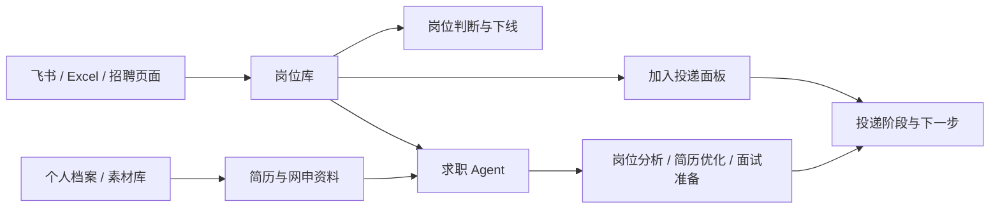

项目坚持三个边界：**不自动提交网申、不批量爬取招聘网站、不让 AI 虚构经历或成果**。关键写入遵循预览、确认、校验和留痕流程。

## 核心亮点

### 1. 岗位数据同步与治理

- 支持 Excel 导入和飞书 OAuth 同步，可读取多维表格以及 Wiki 中关联的表格数据。
- 对外部字段做显式映射、Zod 校验和幂等 Upsert，保留来源链接并标记来源下线岗位。
- 针对非标准企业名称（如“荣耀（8.18 开启）”）提取更新时间，并清理行业字段污染。
- 岗位库支持更新时间排序、公司/岗位、地点和行业筛选；地点采用包含匹配。
- 岗位详情集中展示内推码、投递注意事项、公司介绍和官网入口；不合适的岗位可手动下线并独立归档。

### 2. 投递生命周期管理

- 从岗位库一键加入投递面板，避免重复录入公司、岗位、链接和内推信息。
- 以阶段、下一步和更新时间维护投递进度，覆盖待投递、已投递、笔试、面试、Offer 等状态。
- 服务端统一处理状态变更并记录事件，避免客户端直接拼装关键业务状态。
- 表格采用服务端分页和稳定排序，筛选、翻页与删除后的页码状态保持一致。

### 3. 受控 AI 工作流

- 求职 Agent 共享目标岗位、当前简历、个人偏好和材料上下文，支持岗位分析、简历优化、面试准备与话术生成。
- 对话接口采用流式传输，前端增量渲染模型输出，并处理断流、错误提示和会话保存。
- 模型通过 Provider Adapter 接入 OpenAI-compatible API；结构化输入输出在边界处使用 Zod 校验。
- AI 生成内容先预览再确认；限时签名令牌、幂等键与数据库事务共同降低结果篡改和重复写入风险。

### 4. 智能网申插件

- 基于 WXT + Manifest V3 开发 Chrome 插件，在招聘页面读取岗位信息并回写本地工作台。
- 表单填写采用“确定性规则优先、AI 补全兜底”，适配原生控件、Element Plus、Ant Design 和 Formily 场景。
- 只填写空白且高置信度的字段；密码、验证码、证件、上传控件和歧义字段保持人工处理。
- 插件不会覆盖已有值，也不会自动提交表单，最终结果始终由用户检查确认。

### 5. 事实素材复用

- 个人档案统一维护教育、实习、项目、技能和求职偏好，减少不同招聘系统间的重复填写。
- 素材库将项目成果和经历拆成可复用事实卡片，并支持文案版本管理。
- 简历中心支持多版本组合、A4 预览和导出；面试准备引用岗位 JD 与已有事实，避免脱离上下文生成。

## 系统架构

| 层级 | 职责 | 主要技术 |
| --- | --- | --- |
| Web 客户端 | 岗位、投递、材料、Agent 与面试工作台 | Nuxt 4、Vue 3、TypeScript、Element Plus、UnoCSS、Pinia |
| Server API | 参数校验、业务事务、OAuth、AI Provider 适配 | Nitro Server Routes、Zod、LangChain.js |
| 数据层 | 领域模型、迁移、幂等写入和审计事件 | Prisma、PostgreSQL 16 |
| 浏览器扩展 | 岗位采集、页面上下文识别和受控填表 | WXT、Manifest V3、TypeScript |
| 外部集成 | 岗位源同步与模型调用 | 飞书开放平台、OpenAI-compatible API |

当前仓库规模：**12 个页面、85 个 Server API 文件、24 个 Prisma 领域模型、24 次数据库迁移、37 份功能规格**。这些数据用于说明当前工程覆盖面，会随迭代变化。

## 界面预览

| 首页工作台 | 投递面板 |
| :---: | :---: |
| 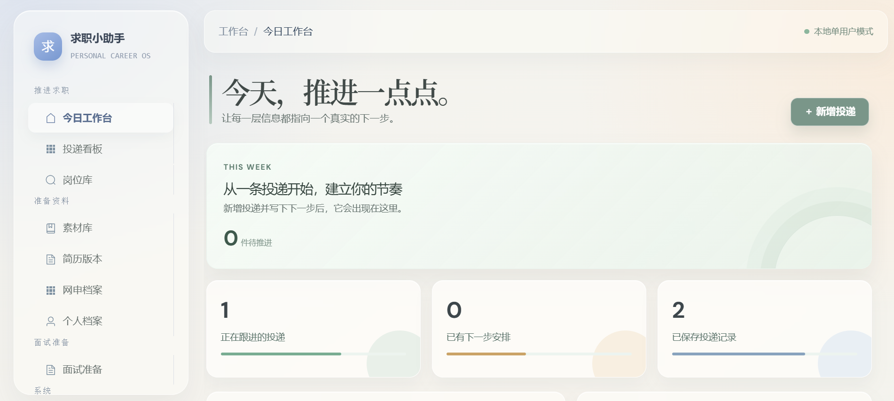 | 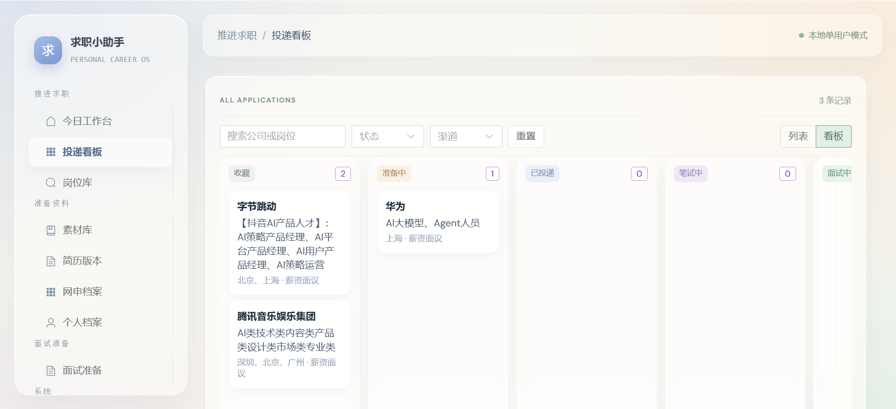 |

| 岗位库 | 网申档案 |
| :---: | :---: |
| 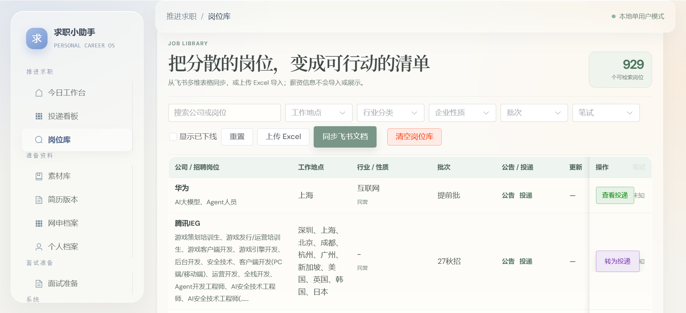 | 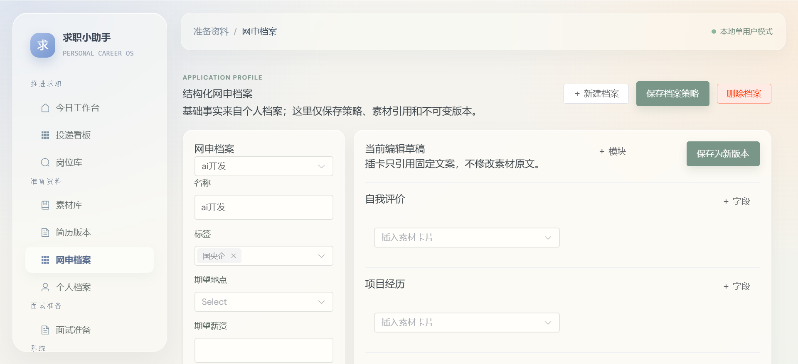 |

| 素材库 | 简历版本 |
| :---: | :---: |
| 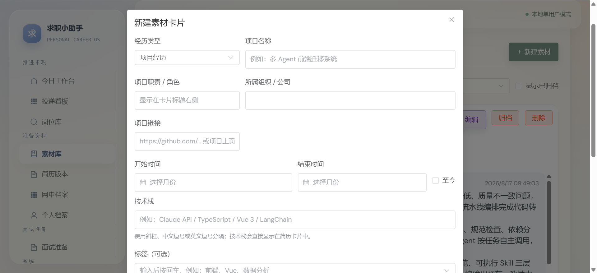 | 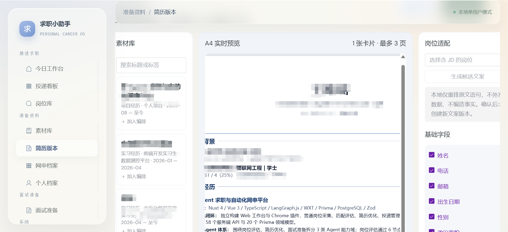 |

| 面试准备 | 求职概览 |
| :---: | :---: |
| 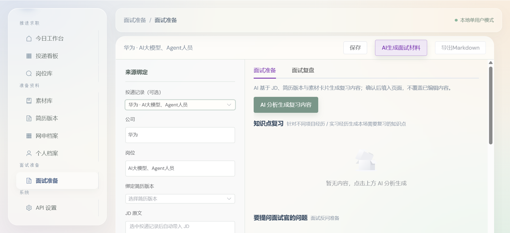 | 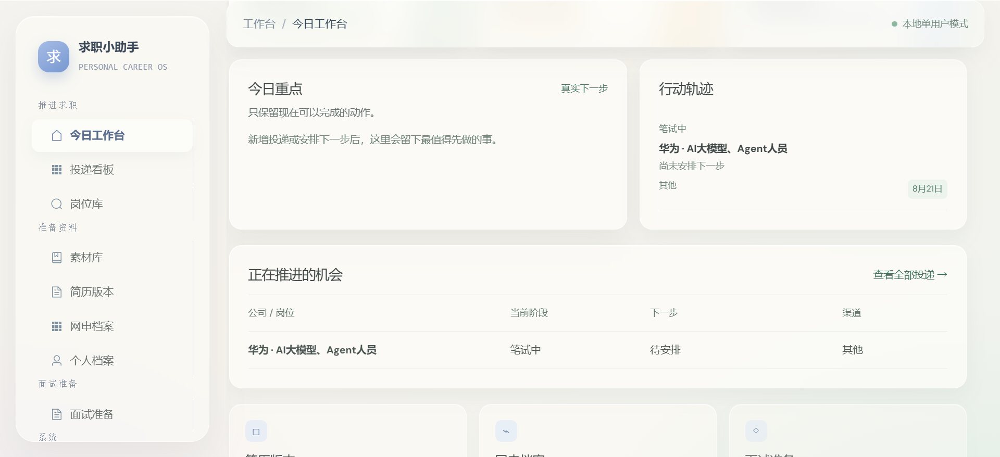 |

### Chrome 插件

| 岗位采集 | 一键填表 |
| :---: | :---: |
| 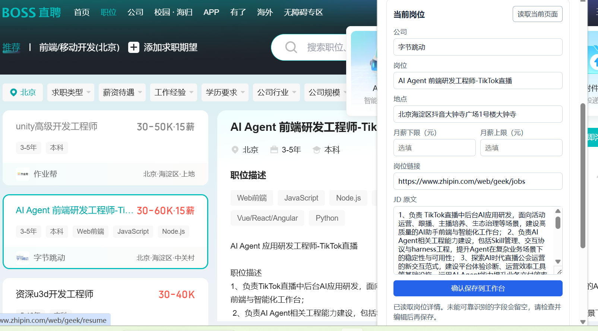 | 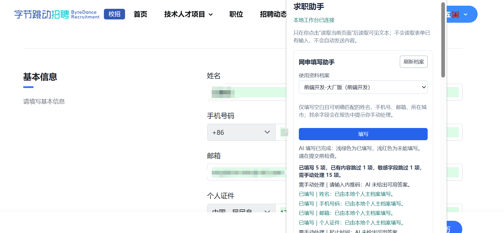 |

## 快速开始

环境要求：Node.js 20+、pnpm 10+、Docker。

```bash
# 启动 PostgreSQL
docker compose up -d

# 安装 Web 依赖并配置环境变量
cd web
pnpm install
cp .env.example .env

# 初始化数据库并启动开发服务
pnpm db:generate
pnpm db:migrate
pnpm dev
```

打开 <http://localhost:3000>。AI 与飞书同步是可选能力，按 [`web/.env.example`](web/.env.example) 配置对应服务端参数即可；真实密钥不得提交到仓库。

### Chrome 插件

```bash
cd extension
pnpm install
pnpm dev
```

随后在 `chrome://extensions` 开启开发者模式，加载 `extension/.output/` 下生成的 Chromium 扩展目录。

## 验证与测试

```bash
cd web
pnpm typecheck
pnpm lint
pnpm build
pnpm test:jobs
pnpm test:career-agent
pnpm test:ai-workflows
pnpm test:profiles
pnpm test:resume-a4
pnpm test:interview-prep
```

插件测试：

```bash
cd extension
pnpm test
pnpm build
```

## 项目结构

```text
job-assistant/
├── web/          # Nuxt 工作台、Server API 与 Prisma 数据层
├── extension/    # WXT Chrome 扩展
├── specs/        # 产品宪章、领域/API 契约和功能规格
├── plans/        # 功能实现方案
├── tasks/        # 可验证的开发任务
├── docs/         # 设计、调研和界面截图
├── commands/     # Spec/Plan/Tasks/Verify 流程命令
└── docker-compose.yml
```

项目采用 `Spec → Contracts → Plan → Tasks → Implement → Verify` 的交付流程。业务规则先沉淀为可验收规格和契约，再进入实现与验证，降低 AI 辅助开发中的需求漂移。

## 后续规划

当前版本已经完成个人秋招使用所需的核心闭环，项目进入阶段性维护。以下内容是后续方向，不代表已经实现：

- 多飞书数据源配置、字段映射预览、增量同步记录和失败重试。
- 跨来源岗位去重、冲突检测及可控合并。
- 围绕下一步日期、笔试和面试安排的提醒与逾期提示。
- 投递漏斗、阶段转化率、来源效果和周期分析。
- 岗位、简历版本、网申档案、Agent 会话与面试材料之间更细粒度的引用追踪。
- 移动端适配、键盘操作、无障碍、错误恢复、端到端测试和部署文档。

## License

[MIT](LICENSE)
