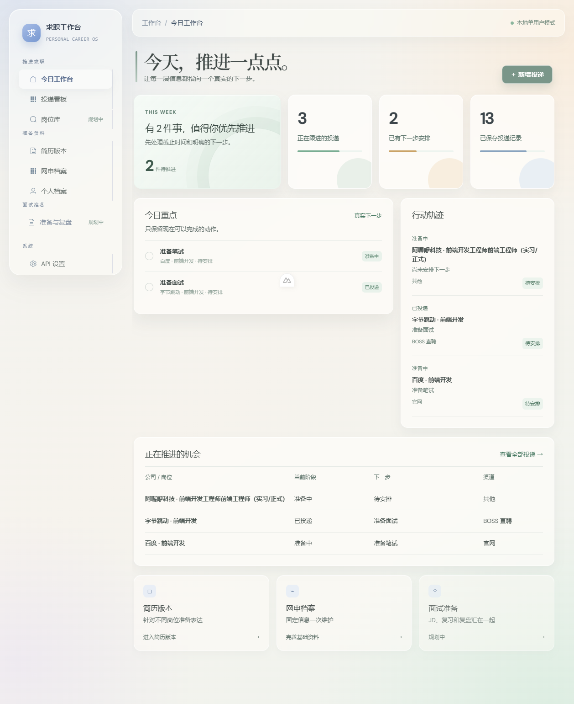

# 秋招求职工作台（Job Assistant）

> 一个面向个人秋招的求职管理系统：用 Web 工作台沉淀机会、投递、材料与复盘，用 Chrome 插件降低岗位录入成本，并用受控的 AI 工作流（LangGraph.js）辅助准备简历与面试。

## ✨ 核心功能

### 1. 投递管理 —— 清楚每一个机会的进展

- **投递看板**：按阶段（待投递 / 已投递 / 笔试 / 面试 / Offer 等）看板式管理，拖拽流转状态，一眼看清"投了哪些、卡在哪一步"
- **岗位库**：手动录入或批量导入岗位，记录公司、JD、薪资、截止时间等关键信息
- **浏览器插件**：浏览招聘网站时一键采集岗位与网申信息，省去逐条手抄的录入成本
- **岗位评估**：AI 结合你的个人画像，评估岗位匹配度，辅助"要不要投"的决策

### 2. 材料准备 —— 一份事实，多处复用

- **个人画像**：教育、实习、项目、技能等基础信息集中维护一次，自动继承到简历、网申、面试材料里，避免重复填写
- **简历中心**：HTML 简历 + A4 固定排版渲染，支持多版本管理与版本删除
- **素材库 & 组合文档**：把经历拆成"素材卡片"，按目标岗位自由组合成文档，一份素材应对多个岗位

### 3. AI 辅助 —— 受控地帮你填表、优化

- **一键表单填充**：识别招聘网站表单上下文（含 Formily 等复杂控件），自动填充网申信息
- **简历优化**：基于你的真实经历优化表达，坚持"不虚构经历、技能或数据"
- **本地 AI 配置**：通过 Provider Adapter 接入 OpenAI 兼容接口，AI 全程经 Zod 校验的工具读写数据

### 4. 面试准备 & 复盘

- **面试准备**：基于岗位 JD + 你的简历 / 项目 / 实习事实，生成结构化复习资料
- **面试复盘**：结构化记录每场面试的问题与表现，沉淀成可追溯、可复习的知识库

> 设计原则：**不做自动投递、不做批量爬取**。AI 只帮你推进真实的下一步，不虚构经历或数据（详见[产品宪章](specs/product/product-constitution.md)）。

## 🖥 界面预览

| 首页看板 | 投递画像 |
| :---: | :---: |
|  |  |

| 个人画像 | 简历中心 |
| :---: | :---: |
|  |  |

## 🧰 技术栈

| 层 | 技术 |
| --- | --- |
| Web 前端 | Nuxt 4 · Vue 3 · TypeScript · Element Plus · UnoCSS · Pinia |
| 服务端 | Nuxt Server Routes（Nitro）· Zod 校验 |
| 数据 | PostgreSQL 16 · Prisma |
| AI | LangChain.js · LangGraph.js（Provider Adapter 接入，兼容 OpenAI 等） |
| 浏览器插件 | Chrome Manifest V3 · WXT · Vue 3 |
| 包管理 | pnpm |

## 🚀 快速开始

> 需要 Node.js ≥ 20、pnpm、Docker（用于本地数据库）。

```bash
# 1. 启动 PostgreSQL
docker compose up -d

# 2. 安装依赖
cd web && pnpm install

# 3. 配置环境变量（复制示例后填你自己的值）
cp .env.example .env

# 4. 初始化数据库
pnpm db:generate
pnpm db:migrate

# 5. 启动开发服务
pnpm dev
```

打开 <http://localhost:3000> 即可看到工作台。Chrome 插件在 `extension/` 目录，用 WXT（`pnpm dev`）构建后加载到 `chrome://extensions`。

## 🔬 测试

```bash
cd web
pnpm test:profiles        # 投递画像
pnpm test:resume-a4       # A4 简历渲染
pnpm test:interview-prep  # 面试准备
pnpm test:ai-workflows    # AI 工作流
```

## 📁 项目结构

```
job-assistant/
├── web/          # Nuxt 工作台（前端 + Server API + Prisma）
├── extension/    # Chrome 浏览器插件（WXT）
├── specs/        # 产品宪章、领域契约、功能规格（F-xxx）
├── docs/         # 设计系统、研发文档、调研
├── commands/     # 研发流程命令（spec/plan/tasks/verify）
└── docker-compose.yml  # 本地 PostgreSQL
```

## 📜 研发流程

每个功能遵循 `Spec → Contracts → Plan → Tasks → Implement → Verify`，没有验收标准、受影响契约和验证方案的需求不落地。

## License

[MIT](LICENSE)
